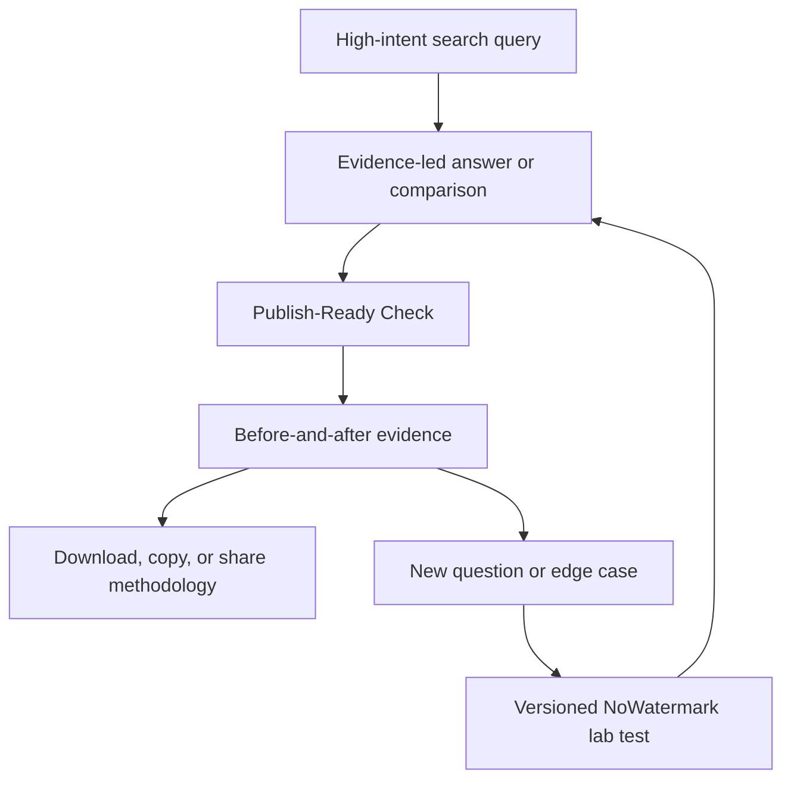
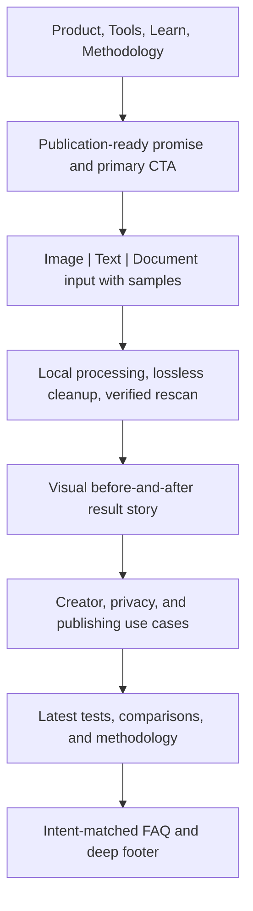

# NoWatermark V2 Growth System - Plan

## Goal Capsule

- **Objective:** Make NoWatermark the trusted publication-readiness product for AI-assisted content, using a stronger product workflow, evidence-led SEO engine, and higher-converting interface to grow organic traffic and technical authority.
- **Primary users:** AI-content creators and privacy-conscious everyday users preparing content for publication.
- **Primary outcomes:** Organic search acquisition and recognized technical credibility.
- **Product boundary:** Help users inspect, safely clean, test, and understand content fingerprints without certifying human authorship or guaranteeing universal detector bypass.

---

## Product Contract

### Summary

NoWatermark V2 will turn the current collection of metadata tools into one publication-readiness system.
Users will inspect fingerprints, remove or reduce supported signals, compare the result, and understand what may still be detectable.
The product, evidence library, search content, and interface will operate as one acquisition and trust loop.

### Problem Frame

The current product has a credible technical core: local processing, lossless container cleaning, explicit detection limits, and verification by rescanning cleaned output.
Its public presentation does not yet make that advantage feel like a distinctive product.
The homepage reads as a capable utility, individual tools are fragmented by keyword, and the site has little usage history from which to infer a roadmap.

Pangram demonstrates how a focused capability can become a larger category presence.
Its site combines a clear claim and product entry point with research, model cards, use-case pages, integrations, named authors, comparison content, FAQs, proof, and a large support corpus.
Its public sitemap contained 256 URLs on 2026-08-15, including 123 blog articles, 65 knowledge-hub articles, 9 use-case pages, and 8 product or solution pages.

NoWatermark should not copy Pangram's institution-focused detector business.
It should create a complementary category around making AI-assisted content publication-ready, with local privacy and verifiable cleanup as its durable advantage.

### Key Decisions

- **Own publication readiness, not generic watermark removal.** This unifies creators, privacy users, tools, content, and UI.
- **Organic acquisition is the first business outcome.** The live product has too little usage for a behavior-led roadmap.
- **Technical proof is the conversion mechanism.** Product claims must be demonstrated through rescans, tests, fixtures, and visible limitations.
- **Detector resistance is a product promise, but not a guarantee of human authorship.** Results must be named, measured, dated, and presented with disagreement and uncertainty.
- **Product, SEO, and UI ship as one growth system.** The product creates evidence, the content captures demand, and the interface converts that demand.
- **Use Pangram as a quality benchmark, not a visual template.** Borrow its clarity, proof density, content architecture, and conversion rhythm while retaining NoWatermark's identity.

### Actors

- A1. **AI-content creator:** Publishes generated or AI-assisted images and text and wants to understand or reduce detectable fingerprints before distribution.
- A2. **Privacy-conscious user:** Wants to remove GPS, device, author, prompt, workflow, and other hidden data without uploading a private file.
- A3. **Search visitor:** Arrives with a narrow question such as “remove AI detection,” “does Instagram remove EXIF,” or “remove ChatGPT watermark.”
- A4. **Technical evaluator:** Judges whether NoWatermark's claims are reproducible and may cite, link to, or recommend the methodology.
- A5. **Publisher:** Maintains articles, test fixtures, change histories, and internal links as products and detection methods change.

### Requirements

**Flagship publication-readiness product**

- R1. NoWatermark must provide one primary “Publish-Ready Check” that accepts an image, file, or pasted text and routes the user into the appropriate inspection flow.
- R2. Every result must classify findings as removable and verifiable, reducible but unverified, non-removable, or unable to verify.
- R3. Cleaning results must preserve the existing scan, clean, rescan, and compare contract so a signal is only reported removed when the cleaned output no longer contains it.
- R4. Results must separate metadata and provenance exposure, privacy exposure, and detector risk instead of collapsing them into one fabricated score.
- R5. Users must be able to choose a cleanup goal such as privacy-safe, provenance-light, or custom selection and see what each action changes before it runs.
- R6. Text users must be able to inspect hidden Unicode and other local signals, optionally rewrite selected text, and review a meaning-preserving before-and-after diff.
- R7. Any text or file data that leaves the device must require an explicit opt-in and show the exact payload and destination.
- R8. Detector tests must name the detector and date, expose disagreement, and avoid presenting a pass as proof of human authorship or a durable guarantee.
- R9. Every completed flow must provide a cleaned download or copy action, a verification summary, and contextual next steps without requiring an account.

**High-leverage feature expansion**

- R10. V2 must include batch image inspection and cleaning with per-file outcomes and a combined export.
- R11. V2 must expose embedded prompts, model settings, and workflows from supported AI-generation formats before offering to remove them.
- R12. V2 must add destination-aware checks for major publishing surfaces, beginning with Instagram, X, Reddit, Discord, and common website uploads.
- R13. V2 must provide a Detector Test Bench for text using authorized named detectors or clearly labeled reproducible benchmarks without scraping services or fabricating scores.
- R14. Detector resistance must be described as reducing signals or improving measured results against named tests, never as making content universally undetectable.
- R15. Rewriting controls must preserve facts, meaning, voice, citations, and formatting rather than maximize stylistic distortion solely to defeat detectors.
- R16. The product must not issue a “human-written” certificate or market detector results as evidence of authorship.
- R17. V2 must publish a versioned capability matrix covering supported file types, inspected locations, removable signals, verification coverage, and known limitations.
- R18. Additional format support should prioritize AVIF and HEIC first, followed by GIF and TIFF; audio and video remain outside V2.

**SEO and editorial engine**

- R19. The site must distinguish five content types: tool pages, evergreen guides, test-lab reports, comparison pages, and concise knowledge-hub answers.
- R20. Each indexable page must serve one primary search intent, link to a relevant product action, and belong to an explicit topic cluster.
- R21. The content system must support provider, detector, format, platform, device, standard, and use-case taxonomies without generating thin permutations.
- R22. Claims about provider behavior, detector performance, or platform metadata handling must cite primary sources or a reproducible NoWatermark test with fixtures, date, environment, and limitations.
- R23. Articles must display a named author or reviewer, publication and update dates, sources, a testing note when applicable, and a correction path.
- R24. Research-sensitive pages must include a “last tested” marker and change history.
- R25. Content must link to the capability matrix and methodology whenever readers need to distinguish metadata removal, pixel watermarking, statistical detection, and provenance reassociation.
- R26. The first editorial wave must target high-intent clusters where NoWatermark can provide a tool or evidence advantage, not broad AI news.
- R27. Evasion-intent queries may be targeted directly, but pages must answer them with measured limitations, legitimate publication workflows, and detector disagreement instead of promising deception.
- R28. The site must publish accurate Pangram-adjacent comparisons only where the products genuinely overlap, distinguishing AI detection from provenance cleanup.
- R29. Existing keyword-targeted tool pages must be consolidated into a hub-and-spoke architecture that avoids duplicate intent and makes Publish-Ready Check the canonical entry point.

**Interface and conversion system**

- R30. The homepage must lead with “Make AI-assisted content publication-ready” or an equivalent claim, followed immediately by the primary tool and privacy and verification proof.
- R31. The visual system must feel editorial, technically credible, and distinctive; it may borrow Pangram's clarity, spacing, typographic contrast, proof placement, and conversion rhythm without copying its brand.
- R32. Product pages must share result language, status colors, proof components, content cards, and calls to action so the site feels like one product rather than SEO microsites.

### Product and Content Flywheel

Content attracts narrow intent, the product produces comprehensible evidence, and that evidence becomes defensible content and links.
The blog is therefore not separate from the product; it is the public record of what the product can prove.

### Key Flows

- F1. **Unified publication check**
  - **Trigger:** A creator or privacy user arrives from the homepage or search.
  - **Steps:** Select image, file, or text; inspect findings; select a cleanup goal; preview effects; clean or rewrite; verify; download or copy.
  - **Outcome:** The user leaves with usable content and a clear statement of what changed and what may remain.
  - **Covered by:** R1-R9.

- F2. **Detector-aware text preparation**
  - **Trigger:** A creator pastes AI-assisted text and wants to understand detector risk.
  - **Steps:** Run local checks; opt into rewriting; review the diff; run named detector tests or view reproducible benchmarks; compare dated results.
  - **Outcome:** The user can reduce measured signals without receiving a false guarantee of human authorship.
  - **Covered by:** R6-R8, R13-R16.

- F3. **Search-to-tool conversion**
  - **Trigger:** A visitor lands on an article from a specific search query.
  - **Steps:** Receive the direct answer; inspect evidence and limitations; use the relevant check; continue to adjacent content only when useful.
  - **Outcome:** The visit resolves the query and creates a qualified tool start.
  - **Covered by:** R19-R29.

- F4. **Evidence publication**
  - **Trigger:** A provider, platform, detector, or format changes behavior.
  - **Steps:** Rerun the documented test; update results and capability coverage; record the date and limitations; refresh linked pages.
  - **Outcome:** Product claims and search content remain traceable and current.
  - **Covered by:** R17, R22-R25.

### Homepage Composition

Pangram repeatedly places a claim, product action, and proof beside one another, then continues through numbered explanations, product visuals, research, testimonials, and FAQs.
NoWatermark should use that persuasion sequence with its own evidence: local processing, lossless cleaning, visible verification, honest limitations, and sample files.

### Priority Feature Set

| Priority | Feature | User value | SEO and authority value |
|---|---|---|---|
| P0 | Publish-Ready Check | One obvious starting point across images and text | Establishes the category and canonical product page |
| P0 | Redesigned result report | Makes removable, remaining, and unverifiable signals understandable | Produces visual proof for landing pages |
| P0 | Selective cleanup presets | Converts technical findings into user goals | Supports privacy, metadata, and fingerprint intents |
| P0 | Evidence-led content system | Turns tests into consistent pages | Enables scalable clusters without thin content |
| P0 | Homepage and navigation redesign | Communicates the product in seconds | Improves conversion from non-brand traffic |
| P1 | Batch image cleaner | Saves repeated work | Opens batch metadata and bulk EXIF queries |
| P1 | Prompt and workflow viewer | Recovers generation context before cleanup | Targets Stable Diffusion and ComfyUI searches |
| P1 | Destination-aware preflight | Answers what happens when users upload to a platform | Creates defensible platform research clusters |
| P1 | Detector Test Bench | Makes resistance measurable and dated | Supports humanizer and detector-comparison demand |
| P1 | AVIF and HEIC support | Covers modern mobile and creator workflows | Expands format and device pages |
| P2 | Shareable local report | Communicates findings without uploading originals | Encourages citations and backlinks |
| P2 | Browser extension | Brings preflight into publishing surfaces | Adds distribution but increases maintenance |
| P2 | Developer API | Supports automated workflows | Adds commercial and developer search surfaces |

### Initial Search Portfolio

| Cluster | High-intent page families | Product destination |
|---|---|---|
| Detector resistance | Remove AI detection, humanizer tests, detector disagreement, reducing false AI flags, named-detector tests | Detector Test Bench and text check |
| AI-image fingerprints | ChatGPT, Gemini, Midjourney, Stable Diffusion, ComfyUI, Firefly, and Flux metadata | Image check and prompt/workflow viewer |
| Provenance standards | C2PA, Content Credentials, SynthID, IPTC DigitalSourceType, durable credentials | Capability matrix and provenance tools |
| Privacy cleanup | EXIF, GPS, device data, author data, timestamps, and document properties | Privacy-safe cleanup preset |
| Platform behavior | Instagram, X, Reddit, Discord, Facebook, LinkedIn, and website uploads | Destination-aware preflight |
| Format workflows | JPEG, PNG, WebP, SVG, PDF, Markdown, AVIF, HEIC, GIF, and TIFF | Format-aware check |
| Comparisons | Metadata removers, detectors vs watermark checkers, Pangram vs NoWatermark, privacy-first tools | Capability comparison pages |
| Research and freshness | Provider changes, detector updates, benchmarks, test corpora, and capability changelogs | Lab and methodology |

### Acceptance Examples

- AE1. **Covers R2-R5.** Given an image containing removable EXIF and an unverifiable pixel watermark, when privacy-safe cleanup runs, then EXIF is verified removed while the pixel watermark remains unable to verify.
- AE2. **Covers R6-R8.** Given text selected for rewriting, the product shows the exact outbound text, destination service, before-and-after diff, and no claim that the result is human-written.
- AE3. **Covers R8, R13-R16.** Given two named detectors return conflicting results, both dated results remain visible and the product reports disagreement rather than averaging them.
- AE4. **Covers R10.** Given a batch containing supported, unsupported, and failed files, each file receives an independent outcome and successful files remain downloadable.
- AE5. **Covers R11.** Given a ComfyUI image with an embedded workflow, the workflow can be viewed or exported before removal is offered.
- AE6. **Covers R12, R22-R24.** Given a platform-behavior page is based on an old test, the page visibly shows its last-tested date until refreshed.
- AE7. **Covers R20, R26-R29.** Given a visitor searches for detector evasion, the page answers directly, presents evidence and limitations, and routes to a relevant test without promising deception.
- AE8. **Covers R30-R32.** Given a first-time mobile visitor, the promise, primary input, local-processing proof, and next action are understandable in the first viewport.

### Release Sequence

**V2.0 — Category and conversion foundation**

- Publish-Ready Check as the canonical entry point.
- Redesigned homepage, navigation, input, and results surfaces.
- Selective cleanup presets and clearer verification language.
- Content taxonomy, author and reviewer metadata, citations, and change histories.
- First evidence-led clusters using current capabilities.

**V2.1 — Creator workflow expansion**

- Batch image processing.
- Prompt and workflow inspection.
- AVIF and HEIC coverage after validation supports credible claims.
- Destination-aware platform preflight backed by reproducible tests.

**V2.2 — Detector-aware publishing**

- Text rewrite improvements and meaning-preservation review.
- Named Detector Test Bench with authorized integrations or reproducible benchmarks.
- Detector and humanizer research pages generated from the same evidence.

**Later expansion**

- Browser extension, developer API, accounts, saved history, and paid bulk workflows only after organic demand identifies the strongest repeated use case.

### Success Criteria

**Product quality**

- Every removal claim can be traced to a rescan or an explicitly identified external test.
- A new visitor can distinguish removable metadata from persistent or unverifiable signals without reading the methodology.
- The flagship flow works without an account and keeps file processing local unless the user opts into a named network feature.

**Organic acquisition**

- At least 90% of submitted V2 pages are indexed within 30 days of discovery.
- At least 20 non-brand queries reach the top 50 within 90 days of the first complete cluster launch.
- Organic guide visitors start a relevant tool at an initial working target of 3%, pending real baseline data.
- No more than one canonical page targets the same primary intent unless another content type serves a different user need.

**Authority**

- Every research-sensitive claim has a source or reproducible test breadcrumb.
- The capability matrix and methodology remain consistent with actual coverage.
- At least six launch pages publish original tests, fixtures, comparisons, or datasets that a third party could cite.
- No page promises guaranteed detector bypass, guaranteed human classification, or verified removal of an untestable signal.

**Interface and conversion**

- The homepage exposes the promise, primary input, and strongest proof in the first viewport on mobile and desktop.
- At least half of users who start a supported scan reach a result, used as a provisional target until enough usage exists.
- Core Web Vitals remain good for most field visits, and guide pages remain free of unnecessary application JavaScript.

### Scope Boundaries

**Deferred for later**

- Accounts, cloud history, teams, institutional dashboards, and billing.
- Browser extensions, desktop applications, and native mobile applications.
- Public API and enterprise integrations.
- Audio and video fingerprint analysis.
- Original detector-model training comparable to Pangram's research program.

**Outside this product's identity**

- Guaranteed universal detector bypass.
- Certification that AI-assisted content was written by a human.
- Advice designed specifically to facilitate academic fraud, impersonation, or false evidence of authorship.
- Removal of visible third-party ownership marks or rights-management watermarks.
- Fabricated detector scores, invented claims, or thin programmatic pages created only for keyword variations.
- Copying Pangram's visual identity, proprietary research claims, customer logos, or institutional positioning.

### Dependencies and Assumptions

- The current local-first, lossless, rescan-based architecture remains the primary technical authority.
- Network-backed text processing remains opt-in and transparent.
- There is no meaningful usage baseline yet; priorities should be revisited after Search Console and product events accumulate.
- Real-time detector testing depends on authorized APIs, acceptable terms, cost controls, and stable outputs.
- Platform claims require repeatable fixtures and periodic verification.
- Editorial quality and evidence matter more than matching Pangram's page count.
- Advertising must not obscure the primary tool, simulate controls, or weaken privacy trust.

### Outstanding Questions

**Deferred to planning**

- Which detector integrations offer authorized, commercially workable APIs for the first Test Bench?
- What freshness window should apply to detector, provider, and platform pages?
- How many P0 and P1 items fit the available build and editorial capacity?
- Which existing keyword pages should remain, merge, redirect, or become views of Publish-Ready Check?
- Which analytics events provide funnel insight without capturing private content or metadata values?

### Sources and Research

- `NoWatermark.fyi — Product Requirements Document.md`
- `README.md`
- `.seo/keyword-map.md`
- `.seo/content-gaps.md`
- `.seo/content-report.md`
- `.seo/linking-plan.md`
- `src/lib/site.ts`
- [Pangram homepage](https://www.pangram.com/)
- [Pangram sitemap](https://www.pangram.com/sitemap.xml)
- [Pangram pricing](https://www.pangram.com/pricing)
- [Pangram image detector](https://www.pangram.com/image-detector)
- [Pangram API](https://www.pangram.com/solutions/api)
- [Pangram integrations](https://www.pangram.com/solutions/integrations)
- [Pangram browser extension](https://www.pangram.com/solutions/chrome-extension)
- [How Pangram detection works](https://www.pangram.com/research/how-it-works)
- [Pangram 4 model card](https://www.pangram.com/research/model-card/pangram-4)
